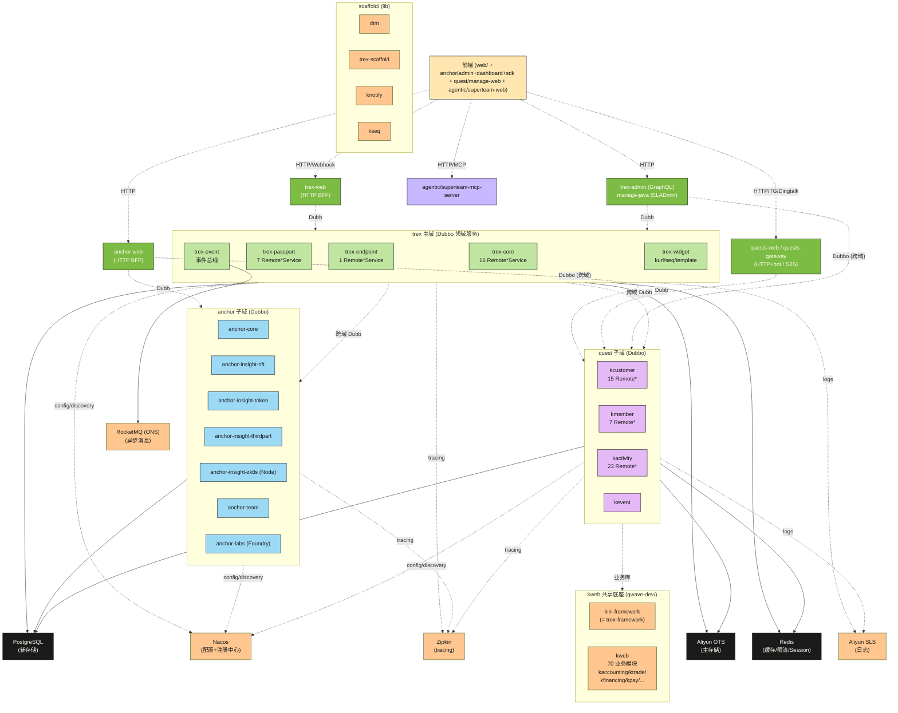
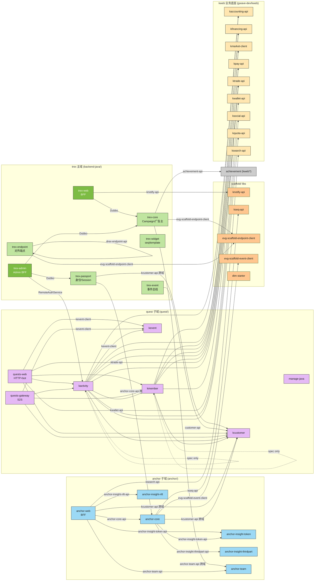

# 后端微服务清单 ⭐

t-rex 后端 GitLab 共 **30 个微服务 + 6 个基础设施**，分 5 个 sub-group：

| Sub-group | 数量 | 类型 | 路径 |
|---|---|---|---|
| **`backend-java/`** | 6 | 微服务 | https://gitlab.com/Keccak256-evg/t-rex/backend-java |
| **`backend-python/`** | 3 | 微服务 | https://gitlab.com/Keccak256-evg/t-rex/backend-python |
| **`anchor/`** | 13 | 微服务（混栈）| https://gitlab.com/Keccak256-evg/t-rex/anchor |
| **`quest/`** | 8 | 微服务（全 Java）| https://gitlab.com/Keccak256-evg/t-rex/quest |
| **`scaffold/`** | 6 | 基础设施 / lib | https://gitlab.com/Keccak256-evg/t-rex/scaffold |

`〔t-rex 现状〕`：本 handbook 当前的 `backend/` 章主体（02–10）针对 **Java 后端**（trex-framework 体系）。Python 后端规约 + anchor 子领域规约**待补**（M3+），先把清单列全。

## 命名约定观察

display name 已统一到 `trex-*` / `anchor-*` 前缀。2026-05-14（TREX-449）把后端 **8 个 URL path 也全部 rename 对齐到 display name**（详见 [`docs/ops/2026-05-14-path-rename-log.md`](../../docs/ops/2026-05-14-path-rename-log.md)）。

**仍未对齐的**：
- `trex-tls/` 下 3 个 path/display 不一致项 —— display 本身可疑，等 owner review 后单独处理

存量旧 path 通过 GitLab redirect 短期仍可 fetch，但 CI / 本地 clones / 文档应该用新 path。

## 服务条目模板

```text
### <service-name>
- **业务范围**：一句话
- **技术形态**：Dubbo 领域服务 / Gateway / 工具 / 智能合约 / ...
- **GitLab URL**：https://gitlab.com/Keccak256-evg/t-rex/<sub-group>/<path>
- **本地路径建议**：{your_workspace}/<sub-group>/<repo>
- **stack**：Java / Python / Node / Foundry / 混栈
- **多模块结构**：[列出 module]
- **上游 / 下游**：调用方 / 被调
- **Owner**：<姓名>（业务对接 / reviewer 候选）
- **最近更新**：YYYY-MM-DD
```

`〔t-rex 现状〕` **Owner 字段是 ASK-don't-guess**：handbook 只记录用户明示的 owner；未明示的标 `TBD（待 ask）`。Owner 用于业务对接 / reviewer 提名 / MR @-ing；具体技术问题仍可走 Linear / 群求助，但 owner 是默认联系人。

---

## A. `backend-java/` — Java 微服务（trex-framework 体系）

### trex-core
- **业务范围**：广告主 / Campaign / Onboarding 等核心领域服务（含 GraphQL 查询层）
- **技术形态**：**Dubbo 领域服务**（按技术分层）
- **GitLab URL**：https://gitlab.com/Keccak256-evg/t-rex/backend-java/trex-core
- **本地路径建议**：`{your_workspace}/backend-java/trex-core/`
- **stack**：Java 17 / Spring Boot / Dubbo / MyBatis-Plus / OTS / PostgreSQL / GraphQL（`spring-boot-starter-graphql` + `graphql-java-extended-scalars 22.0`）
- **多模块结构**：`core-api / core-dal / core-graphql / core-model / core-service / core-web`
- **上游**：trex-web（BFF）；其他领域服务的 Dubbo client
- **下游**：trex-passport；OTS（主）；PostgreSQL（辅）；Redis；Nacos
- **Owner**：TBD（待询问）
- **最近更新**：2026-05-13

### trex-passport
- **业务范围**：用户身份 / 社交平台集成 / 登录 / 签名验证 / Session
- **技术形态**：**Dubbo 领域服务**
- **GitLab URL**：https://gitlab.com/Keccak256-evg/t-rex/backend-java/trex-passport
- **本地路径建议**：`{your_workspace}/backend-java/trex-passport/`
- **stack**：Java 17 / Spring Boot / trex-framework / MyBatis-Plus
- **多模块结构**：`drex-passport-api / drex-passport-dal / drex-passport-model / drex-passport-service / drex-passport-web`（**模块名仍 `drex-passport-*`**；2026-05-14 GitLab path rename 到 `trex-passport` 时未跟改模块名 —— 2026-05-19 audit 校准。POM 内部还引用了历史 `kcustomer-api` 模块作为依赖）
- **上游**：trex-web；其他需鉴权 / 用户信息的领域服务
- **下游**：OTS / PostgreSQL / Redis / Nacos（与 trex-core 同套基础设施）
- **Owner**：TBD（待询问）
- **最近更新**：2026-05-13
- `〔note〕` `trex-passport`（Java backend）与历史 Rust/Foundry `trex-passport`、`anchor-labs`、`anchor-insight-zktls` 容易混淆 —— 当前 `backend-java/trex-passport` 是 Java 版本（path 已在 2026-05-14 由 `drex-passport` rename 到 `trex-passport`，见 `docs/ops/2026-05-14-path-rename-log.md`）

### trex-web
- **业务范围**：对外 API / BFF —— 聚合下游 Dubbo 领域服务，给前端 / 项目方 Portal 用
- **技术形态**：**Gateway**（按业务领域分模块）
- **GitLab URL**：https://gitlab.com/Keccak256-evg/t-rex/backend-java/trex-web
- **本地路径建议**：`{your_workspace}/backend-java/trex-web/`
- **stack**：Java 17 / Spring Boot / trex-framework / OpenAPI 2.0.2 / Aliyun OSS SDK 3.18.1
- **多模块结构**：`drex-module-activity / drex-module-common / drex-module-core / drex-module-customer / drex-module-onboarding / drex-web-start`（2026-05-19 audit 校准；M1 时见过的 `drex-module-growth` 在 master 已不在，可能合并 / 重命名）
- **上游**：前端 / 项目方 Portal（HTTP REST）
- **下游**：trex-core, trex-passport, trex-endpoint, trex-event 等 Dubbo 服务；Nacos；Zipkin
- **Owner**：TBD（待询问）
- **最近更新**：2026-05-13

### trex-endpoint
- **业务范围**：`〔t-rex 现状〕`GitLab description 为空；从模块名（`drex-endpoint-*`）推测为对外端点 / 接入服务（已接管 `anchor-endpoint` 的能力）—— 待 owner 在 GitLab description 补充权威定义
- **技术形态**：**Dubbo 领域服务**（按技术分层）
- **GitLab URL**：https://gitlab.com/Keccak256-evg/t-rex/backend-java/trex-endpoint
- **本地路径建议**：`{your_workspace}/backend-java/trex-endpoint/`
- **stack**：Java 17 / Spring Boot / trex-framework
- **多模块结构**：`drex-endpoint-api / drex-endpoint-dal / drex-endpoint-service / drex-endpoint-web`
- **Owner**：TBD（待询问）
- **最近更新**：2026-05-13

### trex-event
- **业务范围**：事件 / 消息总线服务（含 anchor-event 能力迁移过来）
- **技术形态**：**Dubbo 领域服务**
- **GitLab URL**：https://gitlab.com/Keccak256-evg/t-rex/backend-java/trex-event
- **本地路径建议**：`{your_workspace}/backend-java/trex-event/`
- **stack**：Java / Spring Boot / trex-framework
- **多模块结构**：`drex-event-server`（单模块；master 有完整 pom.xml + 代码）
- **Owner**：TBD（待询问）
- **最近更新**：2026-05-15

### trex-admin
- **业务范围**：运营 / admin 面板 BFF
- **技术形态**：GraphQL BFF
- **GitLab URL**：https://gitlab.com/Keccak256-evg/t-rex/backend-java/trex-admin
- **本地路径建议**：`{your_workspace}/backend-java/trex-admin/`
- **stack**：Java / Spring Boot / GraphQL / trex-framework
- **多模块结构**：`trex-admin-common / trex-admin-dal / trex-admin-graphql / trex-admin-security / trex-admin-start`
- **Owner**：TBD（待询问）
- **最近更新**：2026-05-15（重构 reborn 已合主干，master 已 populated 含 5 模块 + `technical_design/`）
- `〔reborn 期内未完成项〕`（2026-05-19 audit 发现）：
  - **`kiki-observability-tracing-spring-boot-starter` 未接入** —— 其他 backend-java 仓全部接入，trex-admin 是唯一例外
  - **`ops/gitlab-cis/gwave-dev/` 内无对应 CI yaml** —— 其他 5 个 backend 服务都有 `drex-*.yaml`

---

## B. `backend-python/` — Python 微服务

### trex-hexagonal
- **业务范围**：AI agent 平台 —— 统一 API / RAG / 特征存储 / 异步任务编排（生产级）
- **技术形态**：Python FastAPI service + Celery worker + Streamlit UI + 多组件
- **GitLab URL**：https://gitlab.com/Keccak256-evg/t-rex/backend-python/trex-hexagonal
- **本地路径建议**：`{your_workspace}/backend-python/trex-hexagonal/`
- **stack**：Python / FastAPI / LangGraph / Celery / Feast / PostgreSQL / Redis / Streamlit / Docker Compose
- **多模块结构**：`app/` / `ui/` / `feature_store/` / `tests/` / `scripts/` / `data/` / `docs/` + `docker-compose.yml` + `Dockerfile`（master 27 entries 完整 populated）
- **Owner**：TBD（待询问）
- **最近更新**：2026-05-15（master 已初始化完成）

### trex-persona-feast
- **业务范围**：persona 特征工程 + 特征存储（Feast）
- **技术形态**：Python multi-module
- **GitLab URL**：https://gitlab.com/Keccak256-evg/t-rex/backend-python/trex-persona-feast
- **本地路径建议**：`{your_workspace}/backend-python/trex-persona-feast/`
- **stack**：Python / Feast / requirements.txt
- **多模块结构**：`feature_repo / persona-web / technical_design`
- **Owner**：TBD（待询问）
- **最近更新**：2026-05-13

### trex-prism-engine
- **业务范围**：`〔t-rex 现状〕`URL path 历史曾为 `yield-engine`，2026-05-14 已 rename 到 `trex-prism-engine`；从历史命名推测为收益 / yield 计算引擎，待 owner 补充权威定义
- **技术形态**：Python service + web
- **GitLab URL**：https://gitlab.com/Keccak256-evg/t-rex/backend-python/trex-prism-engine
- **本地路径建议**：`{your_workspace}/backend-python/trex-prism-engine/`
- **stack**：Python / requirements.txt
- **多模块结构**：`service / web`
- **Owner**：TBD（待询问）
- **最近更新**：2026-05-13

`〔Python 后端规约缺失〕` 本 handbook 当前 `backend/` 章主体面向 Java；Python 后端的脚手架、依赖管理、测试、日志、可观测性规约**待补 M3+**。建议立项 `backend-python/` 一级目录或独立 sub-handbook。

---

## C. `anchor/` — anchor 子领域（13 项 混栈）

`〔t-rex 现状〕`：**anchor 是 t-rex 的子领域** —— 自成 13 个仓的独立产品线，含 Java 后端、Node/TS、Foundry 智能合约多栈。从仓名/模块名推断业务覆盖链上洞察（`anchor-insight-*`）、NFT、Token、第三方数据、zkTLS、智能合约（`anchor-labs`）；anchor 子域的精确业务边界 / 与 trex 主域接口由 anchor team owner 维护，本 handbook 仅从工程视角列清单。

### C.1 anchor Java 后端（8 项）

| 项目 | URL path | 模块结构 | 业务范围（推测） | Owner | 最近 |
|---|---|---|---|---|---|
| **anchor-core** | `anchor/anchor-core` | `anchor-core-api/common/contract/dal/graphql/server` | 核心领域；**含 `-contract` 模块**（智能合约交互） | 李治锋 | 2026-04-13 |
| **anchor-endpoint** | `anchor/anchor-endpoint` | `anchor-endpoint-api/common/dal/server` | 端点接入（**容器已停用，能力迁移至 `trex-endpoint`**） | 李治锋 | 2026-03-18 |
| **anchor-event** | `anchor/anchor-event` | `anchor-event-server`（单模块） | 事件总线（**容器已停用，能力迁移至 `trex-event`**） | 李治锋 | 2026-03-18 |
| **anchor-insight-nft** | `anchor/anchor-insight-nft` | `anchor-insight-nft-api/common/contract/dal/server` | NFT 洞察；**含 `-contract` 模块** | 项钧 | 2026-04-07 |
| **anchor-insight-thirdpart** | `anchor/anchor-insight-thirdpart` | `anchor-insight-thirdpart-api/common/dal/server` | 第三方数据洞察 | 项钧 | 2026-04-07 |
| **anchor-insight-token** | `anchor/anchor-insight-token` | `anchor-insight-token-adapter/api/common/dal/server` | Token 洞察；**含 `-adapter` 模块** | 项钧 | 2026-04-07 |
| **anchor-team** | `anchor/anchor-team` | `anchor-team-api/dal/model/server/web` | 团队 / 用户域 | 李治锋 | 2026-04-13 |
| **anchor-web** | `anchor/anchor-web` | `anchor-web-api/common/service`（含 Dockerfile + monitoring） | Gateway / BFF | 李治锋 | 2026-05-11 |

`〔t-rex 现状〕`：anchor 各项目的业务范围 / 上下游由 anchor team owner 在 GitLab description 维护，本 handbook 不在此重述。

`〔已停用容器 archive 策略待立〕`：`anchor-endpoint` / `anchor-event` 已停用并迁移到 `trex-endpoint` / `trex-event`；仓库保留只读 / 标记 archived / 文档跳转的选择 —— 待 ops 主理人 + anchor team 共同定。

### C.2 anchor 前端 / Node 工具（3 项）

| 项目 | URL path | stack | 推测 | Owner | 最近 |
|---|---|---|---|---|---|
| **anchor-admin** | `anchor/anchor-admin` | Node.js + TypeScript（`package.json` + Dockerfile） | 运营 admin 前端 / SPA | 李治锋 | 2026-03-12 |
| **anchor-dashboard** | `anchor/anchor-dashboard` | Node.js + TypeScript | 用户 dashboard 前端 / SPA | 李治锋 | 2026-03-12 |
| **anchor-sdk** | `anchor/anchor-sdk` | Node.js + TypeScript（含 `examples/` 目录） | SDK / 客户端工具 | 李治锋 | 2026-05-11 |

`〔t-rex 现状〕`：anchor 前端 3 项与 web/ 同栈（Node + TS），**按需参考 `frontend/` 章通用规范**；anchor team 自治差异（部署目标 / UX 规约 / 业务术语）由各仓 README 注明，handbook 不立专章。

### C.3 anchor 区块链 / 加密（2 项）

| 项目 | URL path | stack | 推测 | Owner | 最近 |
|---|---|---|---|---|---|
| **anchor-labs** | `anchor/anchor-labs` | Foundry / Solidity（`deployments/lib/scripts/src/test`） | 智能合约 lab / 部署 | 李治锋 | 2026-05-12 |
| **anchor-insight-zktls** | `anchor/anchor-insight-zktls` | Node.js + TypeScript（含 `mpc / proxy / migrations`） | zkTLS 数据洞察 / 隐私计算 | 项钧 | 2026-05-12 |

`〔t-rex 现状〕`：智能合约（Foundry / Solidity）+ zkTLS / MPC 类项目仍在产品演进期（anchor-labs lab 状态、`trex-tls/*` 9 个分支并行），handbook **暂不立专章**；规约由各仓 owner 内部维护。产品稳定后再考虑 `blockchain/` / `crypto/` sub-handbook 立项。

---

## D. `scaffold/` — 基础设施 / lib（6 项）

`〔t-rex 现状〕`：2026-05-19 新建的 sub-group，把历史散在 `gwave-dev/` 下的工程脚手架 + 公共 lib 集中归到 `t-rex/scaffold/`。**不是微服务**，是 t-rex 后端工程的共同支撑。

| 项目 | URL path | 类型 | 来源 / 关系 | Owner | 最近 |
|---|---|---|---|---|---|
| **trex-framework** | `scaffold/trex-framework` | parent POM + runtime starters | **替代** `gwave-dev/kiki-framework`（已 fork 过来）—— 新工程统一继承本仓 | TBD（待询问） | 2026-05-19 |
| **trex-scaffold** | `scaffold/trex-scaffold` | 新建工程生成器 | **替代** `gwave-dev/evg-scaffold`（已 transfer + rename） | TBD（待询问） | 2026-05-19 |
| **knotify** | `scaffold/knotify` | 通知 lib | fork from `gwave-dev/knotify`；⚠️ 即将下沉到 `backend-java/trex-widget` | TBD（待询问） | 2026-05-19 |
| **kseq** | `scaffold/kseq` | 序列 lib | fork from `gwave-dev/kseq`；⚠️ 即将下沉到 `backend-java/trex-widget` | TBD（待询问） | 2026-05-19 |
| **kurl** | `scaffold/kurl` | URL 工具 lib | fork from `gwave-dev/kurl`；⚠️ 即将下沉到 `backend-java/trex-widget` | TBD（待询问） | 2026-05-19 |
| **dtm** | `scaffold/dtm` | 分布式事务管理器 | 9 模块: `dtm-{client,client-test,context,core,server,server-test,support-dubbo,support-spring}` + `kiki-dtm-spring-boot-starter`（与 trex-framework 对接的 starter） | TBD（待询问） | 2026-05-21 |

### 关键约定【强制】

- **新工程必须继承 `trex-framework` parent POM**（取代 `kiki-framework`，详见 `02-architecture.md`）
- **新工程推荐用 `trex-scaffold` 生成**（取代 `evg-scaffold`）
- **`knotify` / `kseq` / `kurl` 处于过渡期**：现存依赖可继续用；新代码不要新引入 —— 团队规划把这三个合并下沉到一个新的 `trex-widget` 服务（落 `backend-java/`，未来追加）
- **`dtm` 跨服务事务**：需要跨服务强一致事务时引入 `kiki-dtm-spring-boot-starter`；不需要的服务不强制接入

### 与 `gwave-dev/` 老仓的关系

- `gwave-dev/kiki-framework`、`gwave-dev/knotify`、`gwave-dev/kseq`、`gwave-dev/kurl` 物理仍存在但**视为 deprecated**，禁止新工程引用
- `gwave-dev/evg-scaffold` 已 transfer 到 `t-rex/scaffold/trex-scaffold`，旧 URL GitLab redirect

---

## E. `quest/` — quests 产品线（8 项 全 Java）

`〔t-rex 现状〕`：2026-05-21 新建的 sub-group，承载 **quests 产品线**（系统级别的任务与资产关系系统）的 8 个 Java/Maven 项目。

**架构观察**：
- 4 个 Dubbo 领域服务（`k*` 命名）承载具体业务逻辑
- 2 个 Gateway / BFF（`quests-web` 对外 HTTP + bot；`quests-gateway` 对内 S2S）
- 2 个 Admin（`manage-java` 后台 + `manage-web` 前端）
- **quests-web / quests-gateway 继承自 `com.kikitrade:kweb` parent POM**（位于 `gwave-dev/kweb`，不在 t-rex/scaffold/ —— 作为跨团队共享业务底座保留，详见 `backend/02-architecture.md` §kweb 中间层）
- **其他 k* 服务**直接继承 `com.kikitrade:kiki-framework`（= t-rex/scaffold/trex-framework）

### E.1 Dubbo 领域服务（4 项）

| 项目 | URL path | 模块结构 | 业务范围 | Owner | 最近 |
|---|---|---|---|---|---|
| **kcustomer** | `quest/kcustomer` | `kcustomer-{api,common,dal,service,service-test}` | 用户 / 客户服务（customer service system） | 李嘉琳 | 2026-05-21 |
| **kmember** | `quest/kmember` | `kmember-{api,dal,dtsc,model,service,web,web-test}` + `deploy` | 会员服务 | 李嘉琳 | 2026-05-21 |
| **kactivity** | `quest/kactivity` | `kactivity-{api,dal,model,service,test,web}` + `resources` | 活动服务 | 李嘉琳 | 2026-05-20 |
| **kevent** | `quest/kevent` | `kevent-{client,common,dal,server}` | event collector & dispatcher | 李嘉琳 | 2026-05-21 |

### E.2 Gateway / BFF（2 项）

| 项目 | URL path | 模块结构 | 角色 | Owner | 最近 |
|---|---|---|---|---|---|
| **quests-web** | `quest/quests-web` | `quests-module-{customer,activity,member,common}` + `quests-web-app` | **HTTP 对外接口** + Telegram bot webhook + Dingtalk webhook（含 `MultiBotTelegramWebhook` / `DingtalkController` / `TrexTelegramMessageService`） | 李嘉琳 | 2026-05-18 |
| **quests-gateway** | `quest/quests-gateway` | `gateway-module-{customer,activity,member,common}` + `gateway-web-app` + `gateway-client` | **S2S 内部接口**（Delegate 类带 `S2Api` 后缀 = Server-to-Server；其他后端服务调用 quest 业务的入口） | 李嘉琳 | 2026-05-19 |

### E.3 Admin 后台（2 项）

| 项目 | URL path | 模块结构 | 角色 | Owner | 最近 |
|---|---|---|---|---|---|
| **manage-java** | `quest/manage-java` | `eladmin-{common,generator,logging,system,tools}` + `sql` | 后台管理后端（基于 ELADmin 框架二次开发） | 李嘉琳 | 2026-04-13 |
| **manage-web** | `quest/manage-web` | （目前 master 只有 README，源码可能在 dev 分支） | 后台管理前端 | 李嘉琳 | 2026-05-07 |

### 业务流向（推测）

```
外部用户 / Telegram bot / Dingtalk webhook ─HTTP─→ quests-web ─Dubbo─→ kcustomer / kmember / kactivity / kevent
其他后端服务（含 trex-* 主域）              ─Dubbo─→ quests-gateway ─Dubbo─→ 同上
                                                                             ↓
                                                                       OTS / PG / Redis
```

### 关键约定【强制 + 现状】

- **新工程在 quest/ 沿用 `k*` 命名 + 模块切法**（领域服务: `{name}-api/common/dal/service` 等；Gateway/BFF: `*-module-*`）
- **OpenAPI Delegate 模式**：quests-web / quests-gateway 都用 OpenAPI generator + `*ApiDelegateImpl` 写业务（与 trex-web 同模式）
- **包名 `com.kikitrade.*`**（不是 `com.drex.*` 也不是 `xyz.trex.*`）—— `〔t-rex 现状〕`这是 kweb 体系沿用的历史 groupId，与 t-rex/scaffold/trex-framework 的 `com.kikitrade:kiki-framework` artifact 同 groupId

---

## 全局视图

```text
                       t-rex 后端生态 (30 微服务 + 6 基础设施)
                                       │
   ┌──────────────┬──────────────┬─────┴─────────┬──────────────┬─────────────┐
   │              │              │               │              │             │
backend-java/  backend-python/  anchor/        quest/        scaffold/     (agentic/ 非后端
 (Java 6)      (Python 3)    (13 混栈)       (Java 8)      (基础设施 6)     不计入此图)
   │              │              │               │              │
trex-core      trex-hexagonal  ┌──┴──┐        kcustomer      trex-framework
trex-passport  trex-persona-    Java 非 Java   kmember        trex-scaffold
trex-web        feast           (8)  (5)      kactivity      knotify ⚠️
trex-endpoint  trex-prism-                     kevent         kseq ⚠️
trex-event      engine                         quests-web     kurl ⚠️
trex-admin                                     quests-gateway dtm
                                               manage-java    ↘ knotify/kseq/kurl
                                               manage-web      计划合入
                                                              backend-java/trex-widget
```

## 服务关系图

下面 3 张 mermaid 图源自 2026-05-21 audit：扫描 22 个 Java 仓的 `pom.xml` 取 `*-api` / `*-client` 依赖 + GitLab search 抓 `@DubboReference` 注解 + handbook 内已知调用关系。

`〔t-rex 现状〕`：图反映**当前 master 分支的依赖事实**，业务变化时各 owner 须同步本节。SDK / 智能合约 / zkTLS 子图属 M3+ 范畴本节不画。

### 图 1：总图（生态全局，sub-group 维度 + 数据 / 配置层）



### 图 2：后端图（Java Dubbo 调用关系 / 跨域明确）

**数据源**：22 个 Java 仓 root `pom.xml` 的 `*-api` / `*-client` 依赖（POM 是事实之源，比 `@DubboReference` 注解 search 更准）。



**关键观察**：

1. **trex 主域调 anchor 子域**：`trex-core → anchor-team-api`，`trex-passport → anchor-core-api`
2. **trex 主域调 quest 子域**：`trex-passport → kcustomer-api`，`trex-event → customer-api（kcustomer）`，`trex-admin → kactivity (RemoteAuthService)`
3. **anchor 子域调 quest 子域**：`anchor-web → kcustomer-api`，`anchor-core → kcustomer-api`
4. **quest 子域重度依赖 kweb 业务底座**：kactivity / kmember 几乎拿光 kweb 的 `kaccounting/kfinancing/kmarket/kpay/ktrade/kquota/ksocial` 这堆 `*-api`
5. **scaffold/ lib 跨主/anchor/quest 都在用**：`evg-scaffold-endpoint-client` / `kseq-api` 是真共享底座
6. **trex-event 似乎独立**：未被其他主域服务在 Dubbo 层调用（事件流走 RocketMQ 不走 Dubbo）

### 图 3：前端图（HTTP / WebSocket / Webhook 流向）

**数据源**：前端项目 stack + handbook 已知部署目标 + sub-group 归属。精确的 API 端点列表由各前端项目 owner 维护，本图给业务级流向。

```mermaid
graph LR
    classDef webfe fill:#FFE6B0,stroke:#1A1A1A,color:#1A1A1A
    classDef anchorfe fill:#9CD9F5,stroke:#1A1A1A,color:#1A1A1A
    classDef questfe fill:#E5B9F5,stroke:#1A1A1A,color:#1A1A1A
    classDef agenticfe fill:#C7B8FF,stroke:#1A1A1A,color:#1A1A1A
    classDef sdk fill:#FFC68F,stroke:#2D5A1F,color:#1A1A1A
    classDef tlsfe fill:#F5B9B9,stroke:#1A1A1A,color:#1A1A1A
    classDef bff fill:#7DBC44,stroke:#1A1A1A,color:#FFFCF2
    classDef ext fill:#CCCCCC,stroke:#1A1A1A,color:#1A1A1A

    subgraph WEB["web/ (主域前端)"]
      TWEBSITE["trex-website<br/>主站"]:::webfe
      T2B["trex-2b<br/>2B Portal"]:::webfe
      TEXT["trex-extension<br/>浏览器扩展"]:::webfe
      DAPP["dapp-dashboard<br/>2B Dashboard"]:::webfe
      NFTM["nft-metadata-tookit"]:::webfe
      BSNG["bugsnag-webhook<br/>错误聚合"]:::webfe
    end

    subgraph DEMOS["trex-demos/"]
      PNOT["persona-notary"]:::webfe
      TWREC["thirdweb-reclaim-demo"]:::webfe
      UBRI["universal-bridge-demo"]:::webfe
      TMP["trex-marketplace"]:::webfe
    end

    subgraph ANCH_FE["anchor/ 前端 (3)"]
      AADMIN["anchor-admin<br/>SPA"]:::anchorfe
      ADASH["anchor-dashboard<br/>SPA"]:::anchorfe
      ASDK["anchor-sdk<br/>Node SDK"]:::anchorfe
    end

    subgraph QUEST_FE["quest/ 前端 (1)"]
      MANW["manage-web<br/>admin 前端"]:::questfe
    end

    subgraph AGENT_FE["agentic/ 前端 (1)"]
      STW["superteam-web<br/>Hub Web"]:::agenticfe
    end

    subgraph SDK_PKG["sdk/ + trex-tls/"]
      TPSDK["trex-passport-sdk"]:::sdk
      TPROXY["trex-proxy-browser-extension-sdk"]:::sdk
      TTLS_PLG["trex-tlsn-plugin"]:::tlsfe
      TZKT["trex-zktls-providers"]:::tlsfe
    end

    %% BFF 层
    TWEB_BFF["trex-web (BFF)"]:::bff
    TADMIN_BFF["trex-admin (Admin BFF)"]:::bff
    ANCH_WEB["anchor-web (BFF)"]:::bff
    QWEB_BFF["quests-web (HTTP+bot)"]:::bff
    QGW_BFF["quests-gateway (S2S)"]:::bff
    MJ_BFF["manage-java (admin backend)"]:::bff
    MCP_SVR["superteam-mcp-server"]:::agenticfe

    EXT_TG["Telegram Bot"]:::ext
    EXT_DT["Dingtalk Bot"]:::ext
    EXT_BSNG["Bugsnag SaaS"]:::ext
    EXT_RECL["Reclaim Protocol<br/>(zkTLS)"]:::ext

    %% web/ → BFF
    TWEBSITE -->|HTTP REST| TWEB_BFF
    T2B -->|HTTP REST| TWEB_BFF
    DAPP -->|HTTP REST| TWEB_BFF
    DAPP -->|HTTP REST| TADMIN_BFF
    TEXT -->|HTTP REST + zkTLS| TWEB_BFF
    TEXT -->|HTTP REST| TWEB_BFF
    BSNG -->|Webhook| EXT_BSNG
    NFTM -.NFT 元数据.-> TWEB_BFF

    %% anchor/ 前端 → anchor-web
    AADMIN -->|HTTP REST| ANCH_WEB
    ADASH -->|HTTP REST| ANCH_WEB
    ASDK -.SDK 内置 client.-> ANCH_WEB

    %% quest 前端 → admin / quests bff
    MANW -->|HTTP REST| MJ_BFF
    MANW -.可选.-> QWEB_BFF

    %% agentic 前端 → MCP
    STW -->|HTTP / MCP| MCP_SVR

    %% bot webhook 反向：外部 bot 推到 quests-web
    EXT_TG -->|webhook| QWEB_BFF
    EXT_DT -->|webhook| QWEB_BFF

    %% SDK / tls 项目
    TPSDK -.被业务前端 import.-> TWEB_BFF
    TPROXY -.被业务前端 import.-> TWEB_BFF
    TTLS_PLG -.zkTLS proof.-> EXT_RECL
    TZKT -.providers.-> EXT_RECL

    %% demos
    PNOT -.demo only.-> ANCH_WEB
    TWREC -.demo.-> EXT_RECL
    UBRI -.demo.-> TWEB_BFF
    TMP -.demo.-> TWEB_BFF
```



**关键观察**：

1. **web/ 前端主要打 `trex-web` BFF**（trex-website / trex-2b / dapp-dashboard / trex-extension），少数项目（dapp-dashboard）同时打 admin BFF
2. **anchor 子域前端自闭环**：anchor-admin / anchor-dashboard / anchor-sdk → anchor-web（不直接打 trex 主域 BFF）
3. **quest 子域前端 manage-web** 主要打 manage-java（admin backend），少量场景打 quests-web
4. **agentic/superteam-web** 是独立的 Hub Web，走 MCP 协议打 superteam-mcp-server
5. **Telegram / Dingtalk 是反向流量**（外部 webhook 推进来到 quests-web）
6. **SDK / tls 子项目**多数是 zkTLS / 钱包 / 跨链 demo，连接外部协议（Reclaim Protocol, Bugsnag），不是常规业务前端

## 新增服务

新建后端服务流程见 `backend/appendix/templates/new-service-checklist.md`，并**回到本章追加条目**。

注意 sub-group 归属：
- Java 后端 → `backend-java/`
- Python 后端 → `backend-python/`
- anchor 相关 → `anchor/`（无论栈类型）
- quests 产品线相关 → `quest/`（无论栈类型）
- agent 系统 / AI 工具 → `agentic/`
- 基础设施 / lib / 脚手架 → `scaffold/`

## 后续维护

✅ **已闭合**（截至 2026-05-21）：

- ~~`trex-admin / trex-event / trex-hexagonal` master 为空~~ → 2026-05-15 全部解决（reborn / 误报 / 已 populated）
- ~~GitLab path rename~~ → TREX-449 完成（display name + URL path 对齐到 `trex-*` / `anchor-*`）
- ~~anchor 子领域定位 / 与 trex 主域接口 / 数据流向~~ → §服务关系图 图 1+2 含完整跨域调用
- ~~完整上下游关系图（mermaid）~~ → §服务关系图 总图 / 后端图 / 前端图 三张 mermaid（22 仓 pom.xml `*-api` 依赖扫描 + GitLab search `@DubboReference`）
- ~~22 项目业务范围 + 上下游逐一补全~~ → §服务关系图 mermaid 是 single source of truth；service entry 不再要求重复"上下游"字段

`〔t-rex 现状〕` **不在 handbook 立专章**（owner 各自维护）：

- **Python 后端规约**：由各 Python 项目 owner 在仓内维护（依赖 / 测试 / 日志 / 可观测性 / 部署）；handbook `backend/` 章仅面向 Java
- **anchor 前端规约**：按需参考 `frontend/` 章通用规范，anchor team 维护差异
- **智能合约 / zkTLS / MPC 规约**：产品演进期，由各仓 owner 维护，handbook 暂不立专章

## 维护

- 新增 / 重命名 / 迁移项目需同步更新本章 + GitLab description
- 服务条目变更（业务范围 / 仓库迁移）需同步本章
- sub-group 调整需同步更新 `common/01-gitlab-and-workspace.md`
